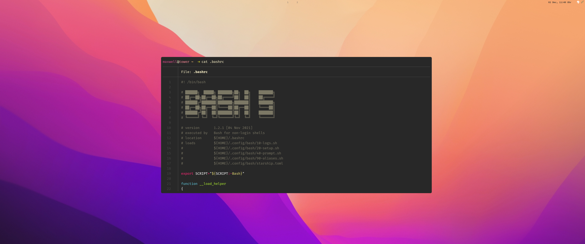

# Ubuntu Desktop Setup (UDS)

## :page_with_curl: About

A simple setup script to configure the desktop theme and style & setup miscellaneous configuration files. UDS configures [_Ubuntu_ 23.04 _Lunar Lobster_][ubuntu-23.04]. It installs various packages and places (new) configuration files. The desktop theme is based upon [_Regolith Linux_][regolith-github] 2.0, which combines the [GNOME] desktop environment and [i3].



The script will

1. (optionally) completely remove `snapd`;
2. (for the next step) setup Personal Package Archives (PPAs);
3. install basic packages;
4. place appropriate configuration files.

[ubuntu-23.04]: https://releases.ubuntu.com/23.04/
[regolith-github]: https://github.com/regolith-linux/
[GNOME]: https://www.gnome.org/
[i3]: https://i3wm.org/

## :rocket: Usage

We assume Ubuntu has already been installed - there are no special requirements or dependencies. The installation script can be downloaded and executed in the terminal. After downloading the script via `wget`, you may optionally enable the `purge_snapd` function by uncommenting it in the `main` function at the very bottom.

```console
$ wget https://raw.githubusercontent.com/georglauterbach/uds/main/setup.sh
$ sudo --preserve-env=HOME,USER,LOG_LEVEL bash ./setup.sh
...

$ reboot
$ regolith-look set gruvbox
```
